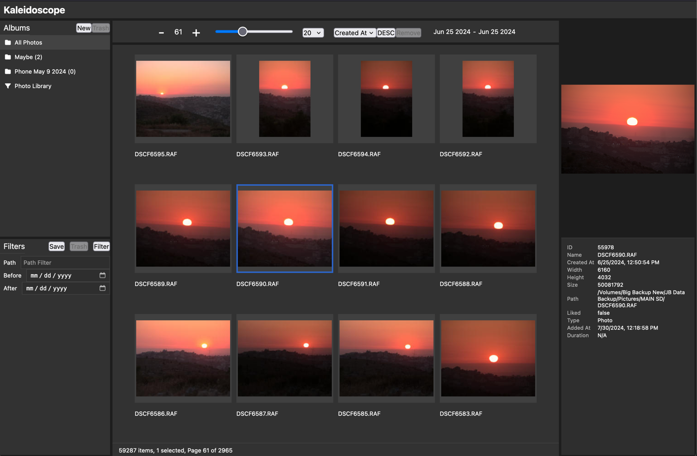

# Kaleidoscope

Kaleidoscope is a simple, but powerful online photo browser

## Features

- [x] Scan and index photos while preserving directory structure
- [x] Quick and small web-friendly thumbnail generation
- [x] Browse thousands of photos via a customizable pagination system
- [x] Metadata extraction and display
- [x] Sort images by metadata keys including name, size, create date
- [x] Filter photos by path and before and after dates
- [x] Supports multiple image formats including RAW photos
- [x] Fullscreen photo viewer with download options for full-size thumbnail or original file (to download RAW photos)
- [x] Create photo albums
- [x] Create smart albums or "views" to save filters and sorting options

## Design

Kaleidoscope is composed of three main components:

1. **Scanner**: A command-line tool that read the config file, scans a directory and indexes all photos. The scanner creates a SQLite database with all the metadata extracted from the photos. The scanner also generates thumbnails for all photos in the specified directory.
2. **Server**: A web server that serves the UI and the API. The server reads the SQLite database and serves the photos and metadata to the UI via a simple REST API. Communicates with the daemon via Unix sockets IPC for file access.
3. **Daemon**: A privileged background process that runs on the server. Enforces permissions on the config file. Communicates with the server via Unix sockets IPC for file access to avoid file permission issues when running the server as a non-root user.